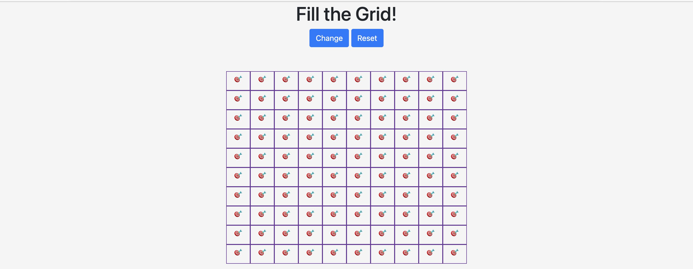
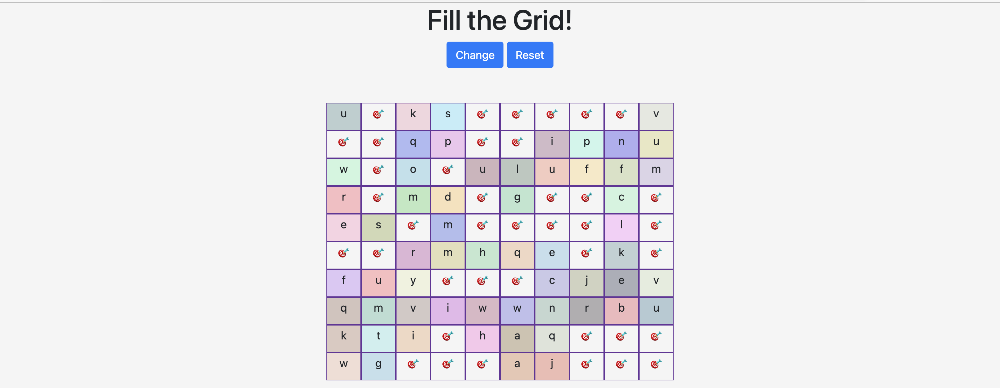
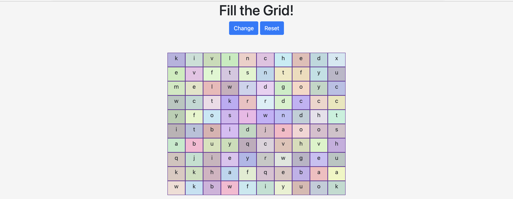
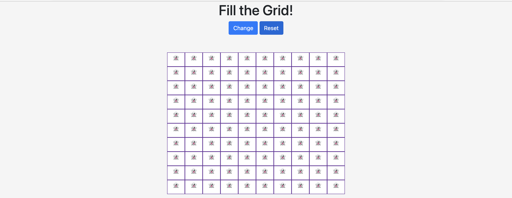
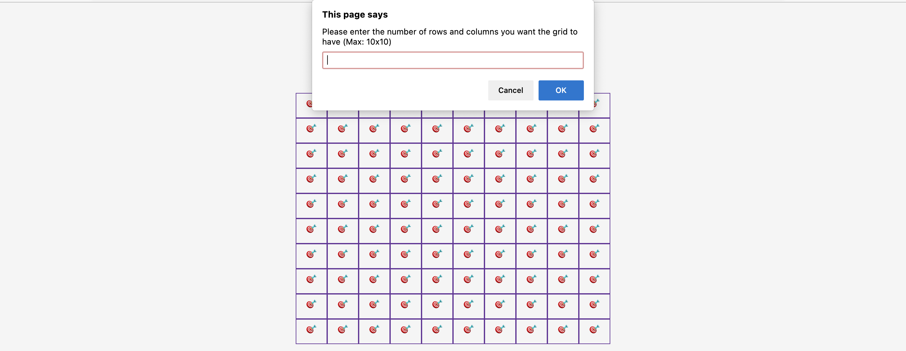
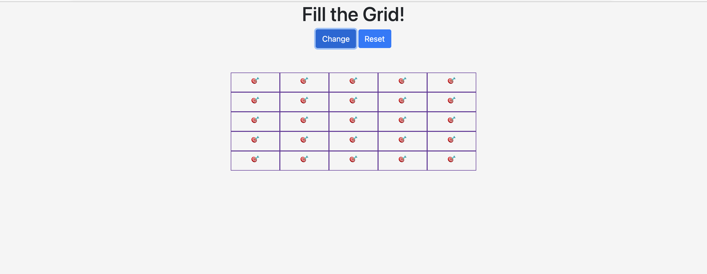

# Fill the Grid
A simple web application which challenges you to fill in the grid

# Landing page
When you fire up the webpage, you'll be greeted with a grid filled with the 🎯 emoji. The challenge is to fill in the cells that contain the 🎯 emoji, which you can do by hovering your cursor over.

As you move your cursor along the grid, the cells simultaneously change in colour and display a random alphabetical character.

Now, fill the grid with random colours and letters!

# Reset
You can reset a grid by clicking on the blue button above it, labelled _Reset_. By resetting the grid, it returns to its original state, but this time, the cells contain the 👻 emoji instead of 🎯.

# Change the grid
You can change the dimensions of the grid by clicking on the blue button above the grid, labelled _Change_. You can have up to a maximum of a 10x10 grid.

For example, you can input 5 in the prompt to change the dimensions of the grid to 5x5.

